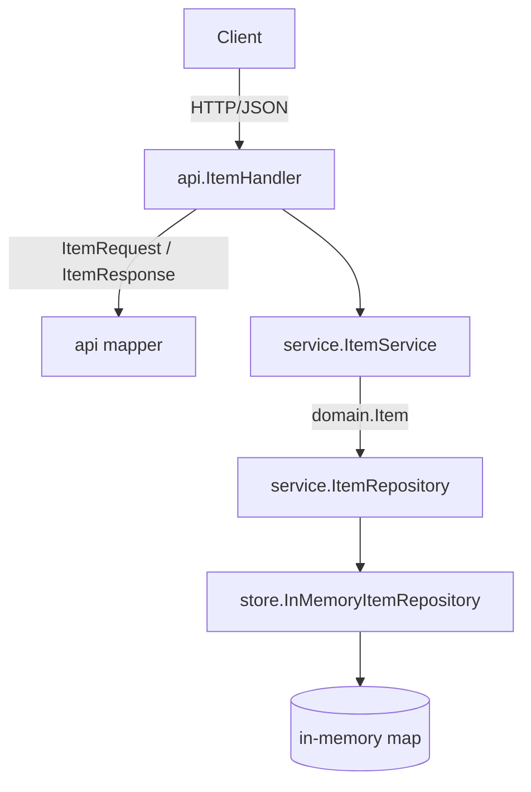

# Architecture

The service is a layered Go application built on Gin. A request enters at the
handler, which speaks DTOs, and travels down through the service, which speaks the
domain type, to an in-memory store adapter, which speaks the repository port. Each
layer depends only on the layer below it.

## Layers

- `internal/item/api/` holds the Gin handler, the transport DTOs, the RFC 7807 problem detail, the request validator, and the mapper between DTOs and the domain. It carries the swag annotations, so the OpenAPI document is generated from this code.
- `internal/item/service/` holds the business logic and the `ItemRepository` port. It works in `domain.Item` and depends on the port, not on the adapter.
- `internal/item/domain/` holds `Item`, the type the service reasons about, and `NotFoundError`. It has no framework imports.
- `internal/item/store/` holds the in-memory adapter that implements the port, along with the three dev seeds.
- `internal/app/` wires the layers into a Gin engine. `main.go` starts the HTTP listener.
- `internal/openapi/` generates `docs/openapi.json` from the annotations. `cmd/spec` writes the file.

## Containment

The handler never sees a store record and the service never sees a DTO. The adapter is the
only place that writes to the map, and the mapper is the only place that converts between
`domain.Item` and the DTOs. That keeps the framework out of the domain and the business logic.
